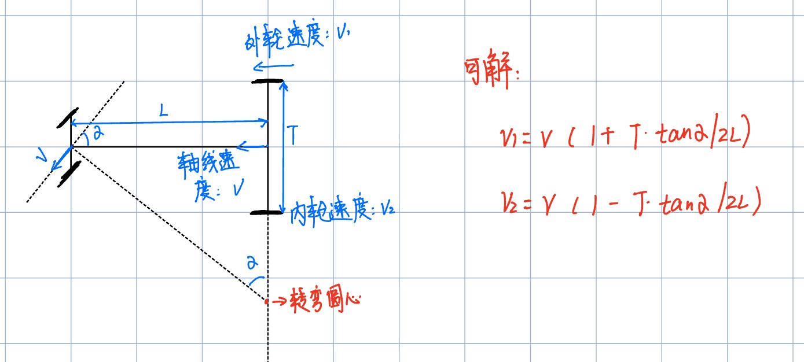
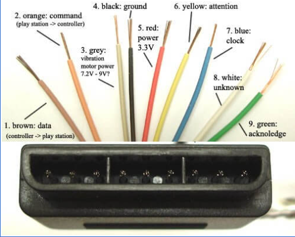
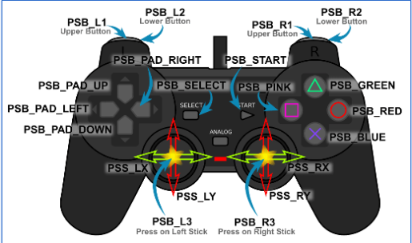

# 2023全国大学生电子设计竞赛（？题）参赛纪录
- 成员：时涵天 孙豪 王湘
- 程序语言：Arduino

## 如何成功烧录？
1. 取下显示屏
2. 将 M 开关拨到烧录模式
3. 如果烧录失败可以按下 nano 板上的reset 按键或者重新插拔数据线
## OLED显示屏使用
### 显示原理
该显示器由两个坐标轴构成，y轴从上到下增大，共7个单位，x轴从左至右增大。显示时，一行占据y轴1个单位，一个字符占据x轴6个单位。使用时，我们需要指定显示的坐标和内容。
### 相关代码和API
- 
    ```c
    ///OLED显示屏引脚///
    #define OLED_DC 10
    #define OLED_CLK 19
    #define OLED_MOSI 13
    #define OLED_RESET 12
    ```
- `SSD1306 oled(OLED_MOSI, OLED_CLK, OLED_DC, OLED_RESET, 0)`：定义一个显示屏对象
- `oled.ssd1306_init(SSD1306_SWITCHCAPVCC)`：显示屏初始化
- `oled.clear()`：清空显示屏上的内容
- `oled.drawchar(int x,int y, char ch)`：将一个字符放到显示器的缓存区
- `oled.drawstring(int x,int y, string s)`：讲一个字符串放到显示器的缓存区
- `oled.display()`：将缓存区中的内容进行显示
更详细的使用方法可以参考[链接](https://www.jianshu.com/p/5d4c85af5a79)

## 小车运动的数学模型


### 相关代码
```c
void Kinematic_Analysis(float velocity, float angle) {
  char K = 1;
  Target_A = velocity * (1 + T * tan(angle * pi / 180) / 2 / L);
  Target_B = velocity * (1 - T * tan(angle * pi / 180) / 2 / L); //后轮差速
  servo = 95 + angle * K; //舵机转向，为什么是95呢？
  //  if(servo>95)servo=servo*1.15;
  myservo.write(servo); //指定舵机转向的角度
}
``````
其中，velocity 和 angle 是从串口接收到的速度指令，Target_A/Target_b是计算得出后轮内外轮的具体速度

## 直流电机的控制
### 控制原理
直流电机有一般有两根引线，定义为 IN1 和 IN2，通过 IN1 和 IN2 的差值决定电机的转速大小。比如，IN1 比 IN2 大，电机正转，反之则反转，具体转速由差值大小决定。在本辆小车中，IN1 和 IN2 的大小在0~255之间。
### 相关代码
```c
// 引脚绑定
#define AIN1 11
#define AIN2 5
#define BIN1 6
#define BIN2 3
#define SERVO 9

// 控制两个电机转速的函数，其中 motora 和 motorb 是-255~255之间的数，符号决定转向，数字决定转速
void Set_Pwm(int motora, int motorb) {
  if (motora > 0)      analogWrite(AIN2, motora), digitalWrite(AIN1, LOW); //赋值给PWM寄存器
  else                 digitalWrite(AIN1, HIGH), analogWrite(AIN2, 255 + motora); //赋值给PWM寄存器

  if (motorb > 0)       digitalWrite(BIN2, LOW), analogWrite(BIN1, motorb); //赋值给PWM寄存器
  else                  analogWrite(BIN1,255 +motorb), digitalWrite(BIN2, HIGH); //赋值给PWM寄存器
}
```

## 增量PID算法与速度控制
### 原理
与常见的位置PID不同，增量PID算法的公式是：
$$\Delta u(k) = K_p(e(k)-e(k-1)) + K_ie(k) + K_d(e(k)-2e(k-1)+e(k-2))$$
### 特点
位置PID控制器的主要优点是其准确性。它们可以非常精确地跟踪移动目标。然而，位置PID控制器对所需位置的变化的响应可能较慢。增量PID控制器的主要优点是其速度。它们可以非常迅速地对所需速度的变化做出反应，**通常用于系统需要保持恒定速度的应用中**。然而，增量PID控制器可能不如位置PID控制器精确。
所以，控制小车时使用增量PID控制小车的速度。
### 相关代码
```c
int Incremental_PI_A (int Target,int Encoder)
{   
   static float Bias,Pwm,Last_bias;
    Bias=Target-Encoder;                                  //计算偏差
   Pwm+=Velocity_KP*(Bias-Last_bias)+Velocity_KI*Bias;   //增量式PI控制器
   if(Pwm>255)Pwm=255;                                 //限幅
   if(Pwm<-255)Pwm=-255;                                 //限幅  
   Last_bias=Bias;                                       //保存上一次偏差 
   return Pwm;                                           //增量输出
}
int Incremental_PI_B (int Target,int Encoder)
{   
   static float Bias,Pwm,Last_bias;
   Bias=Target-Encoder;                                  //计算偏差
   Pwm+=Velocity_KP*(Bias-Last_bias)+Velocity_KI*Bias;   //增量式PI控制器
   if(Pwm>255)Pwm=255;                                 //限幅
    if(Pwm<-255)Pwm=-255;                                 //限幅  
   Last_bias=Bias;                                       //保存上一次偏差 
   return Pwm;                                           //增量输出
}
```
其中，Target 是电机转速的目标值，Encoder 电机转速的当前值。

## 光电编码器
### 原理
光栅盘是在一定直径的圆板上等分地开通若干个长方形孔。由于光电码盘与电动机同轴，电动机旋转时，光栅盘与电动机同速旋转，经发光二极管等电子元件组成的检测装置检测输出若干脉冲信号，通过计算每秒光电编码器输出脉冲的个数就能反映当前电动机的转速。为判断旋转方向，码盘还可提供相位相差90°的两路脉冲信号。
在本小车中，编码器通过外部中断连接到主板，通过两相信号同时判断电机的转速和方向。
### 相关代码
```c
/////////编码器引脚////////
#define ENCODER_L 8  //编码器采集引脚 每路2个 共4个
#define DIRECTION_L 4
#define ENCODER_R 7
#define DIRECTION_R 2

attachInterrupt(0, READ_ENCODER_R, CHANGE);           //开启外部中断 编码器接口1
attachPinChangeInterrupt(4, READ_ENCODER_L, CHANGE);  //开启外部中断 编码器接口2

void READ_ENCODER_L() {
  if (digitalRead(ENCODER_L) == LOW) {     //如果是下降沿触发的中断
    if (digitalRead(DIRECTION_L) == LOW)      Velocity_L--;  //根据另外一相电平判定方向
    else      Velocity_L++;
  }
  else {     //如果是上升沿触发的中断
    if (digitalRead(DIRECTION_L) == LOW)      Velocity_L++; //根据另外一相电平判定方向
    else     Velocity_L--;
  }
}
/*****函数功能：外部中断读取编码器数据，具有二倍频功能 注意外部中断是跳变沿触发********/
void READ_ENCODER_R() {
  if (digitalRead(ENCODER_R) == LOW) { //如果是下降沿触发的中断
    if (digitalRead(DIRECTION_R) == LOW)      Velocity_R++;//根据另外一相电平判定方向
    else      Velocity_R--;
  }
  else {   //如果是上升沿触发的中断
    if (digitalRead(DIRECTION_R) == LOW)      Velocity_R--; //根据另外一相电平判定方向
    else     Velocity_R++; // ?????
  }
}
```

## 遥控手柄
### 接线及按钮


### 相关API
- `config_gamepad(uint8_t, uint8_t, uint8_t, uint8_t, bool, bool)`：将手柄的引脚连接到Arduino的数字引脚
- `ps2x.read_gamepad()`：Arduino均与PS2控制器完成通信并收集所有的输入数据
- `ps2x.ButtonPressed()`：简单的按下某个按钮，返回bool
- `ps2x.Button()`：持续按住某个按钮，返回bool
- `ps2x.Analog()`：读取某个模拟量
### 相关代码
```c
error = ps2x.config_gamepad(PS2_CLK, PS2_CMD, PS2_SEL, PS2_DAT, false, false);//PS2控制
ps2x.read_gamepad(false, 0); //read controller and set large motor to spin at 'vibrate' speed
PS2_LY=ps2x.Analog(PSS_LY);
PS2_RX=ps2x.Analog(PSS_RX); // 读取摇杆值
LY = PS2_LY - 128; //计算偏差
RX = PS2_RX - 128;
if (LY > -Yuzhi && LY < Yuzhi)LY = 0; //小角度设为死区 防止抖动出现异常
if (RX > -Yuzhi && RX < Yuzhi)RX = 0;
Velocity = -LY / 5; //速度和摇杆的力度相关。
Angle = RX / 4;
```
上面是使用摇杆控制小车的核心代码。

## 相关代码功能和使用
### `main_arduino.ino`
这个是小车上烧录的代码，由于烧录的不方便所以一般不作修改。

我们可以通过如下串口命令对小车进行控制：
- `Mode0/`：切换模式为0，该模式下小车速度和转角都为0且不可更改，也可以通过按扩展板上的 K1 键进行切换
- `Mode1/`：切换模式为1，该模式下可以通过下面的命令对小车的速度和转角进行设置
- `<sxxsxx>`：设置小车的速度和转角
### `main_k210.py`
控制的核心模块，通过下发串口命令控制小车。
 


## 当前存在的问题
- 蓝牙串口通信不稳定，具体表现为：
  - 一台机器出现两个蓝牙信号
  - 连接成功后又立马从“已连接”变成“已配对”
  - 串口工具可以看到蓝牙串口，但是上传失败
- 本来准备在新代码里面加入遥控功能，但是始终不知道哪里出了问题，考虑到后面也不会用到这个功能，所以算了