# 空地协同智能消防系统

## 摘要

本项目设计了一个由四旋翼无人机和消防车构成的空地协同智能消防系统。无人机负责巡逻检测火源,消防车负责灭火。该系统的设计目标是实现无人机对火源的侦察以及消防车的灭火，并缩短巡逻覆盖时间和灭火响应时间。

本设计采用无人机按照规划航线快速巡逻,发现火情后进行初步灭火,同时通知消防车赶赴灭火。无人机和消防车之间实现无线通信和定位,无人机发送火源位置,消防车接收后快速赶赴灭火。该设计充分利用无人机的高效巡逻能力和消防车的大范围灭火能力,实现快速灭火。关键技术包括无人机巡逻航线规划、目标检测与跟踪、无线通信与定位、消防车路径规划等。通过空地协同和快速响应,有望缩短灭火时间,提高消防效率。

### 关键词

无人机 python wifi yolo K210 Arduino Linux

## 引言

在近年来，无人机和无人驾驶车辆在各种环境中表现出强大的适应性和效能，特别是在危险或不便进入的环境中。我们的项目旨在设计一个基于无人机和无人消防车的自动化火源检测和扑救模拟系统，以提高火灾应急响应的效率和安全性。

设计这样一个系统涉及到的问题包括：火源的快速和准确检测，火源位置的精确确定，以及无人机和无人车的协同工作。我们的解决方案是，无人机巡逻并使用内置的摄像头检测火源，然后将火源的位置信息发送给无人车，无人车根据接收到的信息进行导航和扑火。

我们选择大疆的Tello无人机作为空中平台，因为它小巧轻便，操作灵活，而且有完整的软件开发工具包支持编程控制。同时，我们采用了传统的四轮双驱微缩车作为地面平台，并使用 K210 模块和 Arduino Nano 单片机来实现其控制任务。

本文档将详细介绍我们的设计方案，包括系统的构成，电路设计，软件设计，以及系统的工作流程。

## 设计与计算

### 巡航规划

#### 无人机巡航路径规划

我们希望无人机能够巡航回到出发点，并且能在最短的时间里遍历所有中方（8dm*8dm），因此我们设计了如下图所示的路线进行巡逻。

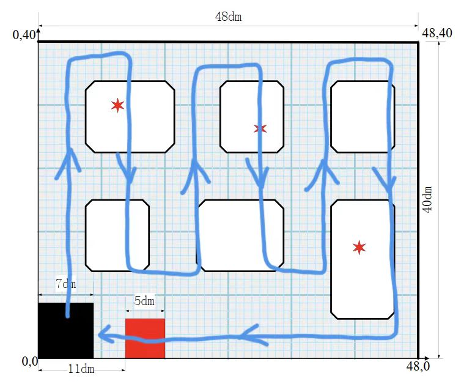

无人机巡逻路线示意图

#### 微缩消防车导航路径规划

我们希望无人车准确地到达指定地图坐标进行灭火，同时不得驶入街区部分。地图可以认为是一个直角坐标系，消防车将行驶直线+90度转弯到达灭火点。下图是三条灭火示例路线。


### 检测方法

#### yolo5 算法训练识别模型

项目中最重要的检测在于能否在无人机向下拍摄的照片中识别到是否存在火源。我们使用yolo5 进行实时目标检测。

将采集得到的适量的样本照片上传到<https://app.roboflow.com/>  进⾏在线数据标注。接下来在本地进行数据模型的训练

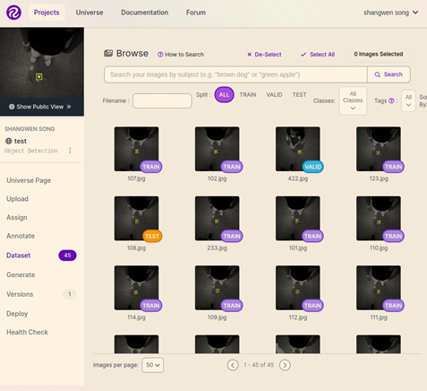

样本图片在线数据标注截屏

导出为yolo 类型的数据集并采⽤训练\验证\测试数据等量分类,导⼊之后采
⽤以下命令:

```python
python3 train.py --img 640 --batch 16 --epochs 100 --data 导出的内容(对应路径) --weights yolov5s.pt
```

上述内容即为使⽤yolo5s.pt预训练参数进⾏学习训练,并在runs ⽂件夹内对应得到小灯模型。

实际使⽤
转换模型:

```python
python3 export.py --weights

./runs/train/exp5/weights/best.pt --include onnx
```

转化好后在runs ⽂件夹内⾃⼰可以找到(程序会提⽰位置)
本机训练好后可以将模型转移到onnx ⽂件内进⾏识别即可视化模型,你们可以把.onnx ⽂件传进去⾃⼰导出。


神经网络可视化模型

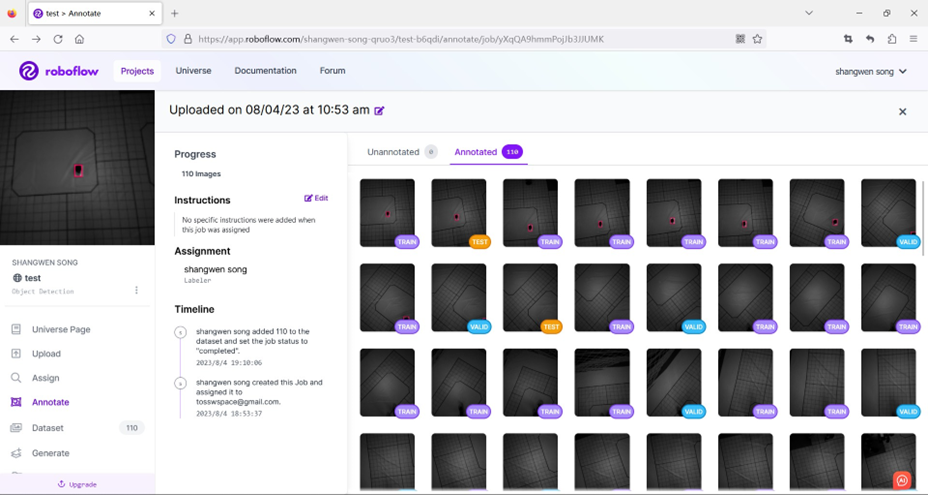


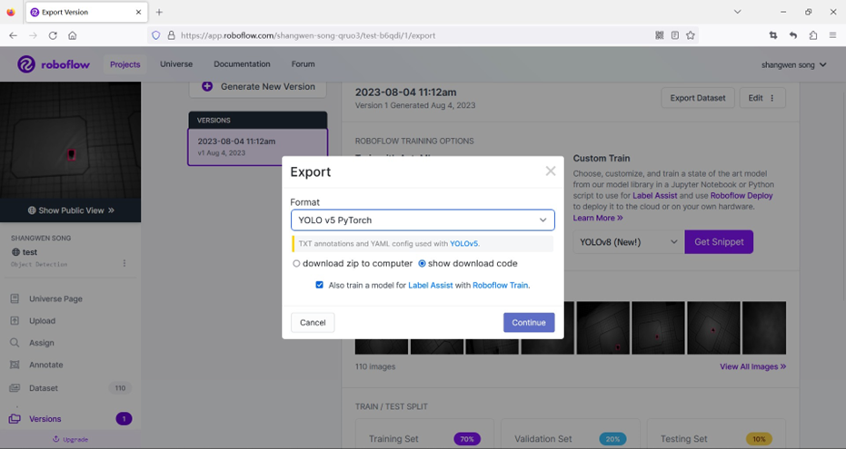
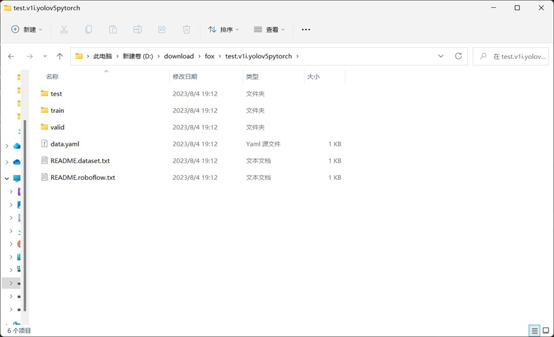
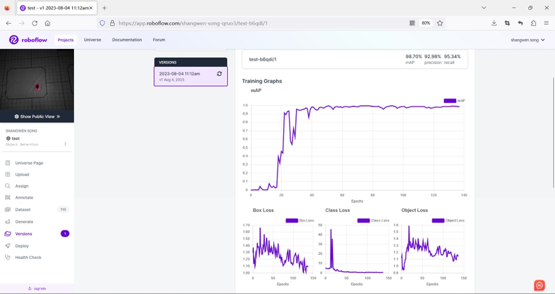

数据标注过程截图

#### 距离识别

由下⽅摄像头进⾏流光算法
背景问题:

1. ⻜机⾏进过程中会产⽣⻆度偏移,会导致激光位置不是当前实际位置
2. ⻜机⾼度不会恒定在1.8m,会导致图⽚参考系不⼀致

处理⽅法:
假设地⾯⽅格线实际距离为 ,相机距离与⽅格线距离 求解⽅式为:

$dis=f(a,\text{待定参数,当前陀螺仪读取的倾斜角度})$

理论讲是⼀个线性⽅法:

- 可以根据当前的激光所在位置的⽅格线⻓度计算当前激光距离
- 根据激光距离与倾斜⻆求解投影距离
- 上⼀阶段所计算的运动⽅向向量可以近似表达为当前状态的⽅向向量
- 由激光所在的位置向⽅向向量偏移投影距离的⻓度即为当前真实所在的位置

接下来:

- 在地图中将左下⻆标记为坐标系原点
- 采⽤光流⽅案判断⽆⼈机的从上⼀个状态的变化向量（x,y）
- 从原点初始考虑每⼀帧的变化做累加

### 控制方法

#### 对无人机

这个项目对无人机的控制方法主要基于大疆的Tello SDK和RoboMaster库，通过Python编程来实现无人机的控制。

在这个项目中，对无人机的主要控制如下：

1. **初始化和连接无人机：** 该步骤涉及到启动无人机，建立起无人机与控制设备（这里可能是一台电脑或者开发板）之间的WiFi连接。

2. **无人机起飞：** 通过RoboMaster库的起飞命令，启动无人机的电机并使其离地起飞。

3. **无人机飞行控制：** 这包括无人机的飞行路径控制，包括向前、向后、向左、向右移动，以及上升和下降。这些控制都可以通过RoboMaster库中的相应命令来实现。

4. **获取无人机传感器数据：** RoboMaster库还能获取无人机的传感器数据，包括图像、姿态等。这些数据可用于环境感知，以及飞行状态监控和控制。

5. **无人机降落：** 在任务完成后，无人机会执行降落命令，然后关闭电机。

在实际编程过程中，为了达到控制无人机巡航并在适当的间隔时间进行拍照的需求，可能会创建一个主循环，其中包含飞行控制命令和拍照命令。通过在主循环中调整这些命令的执行频率和顺序，可以实现无人机的巡航控制和定时拍照。

在开发和测试阶段，所有的控制代码都在电脑上编写和运行。在实际部署阶段，将相同的代码环境配置在开发板的Linux系统中，并运行相同的代码，从而使无人机执行期望的任务。

#### 对微缩消防车

该项目对微缩消防车的控制方法主要分为两个层次：高层逻辑处理和底层硬件控制。

1. **高层逻辑处理：** 在高层逻辑处理中，主要由K210模块负责。这个模块运行Python程序，处理图像识别、路径规划、目标识别、避障等高级任务。它通过摄像头获取周围环境的信息，然后利用图像处理和机器视觉技术对这些信息进行解析，生成对应的控制指令。这些指令可能包括移动方向和速度、避障策略等。K210模块还接入了WiFi模块，可以进行无线通信，例如接收远程指令或者发送状态报告等。

2. **底层硬件控制：** 在底层硬件控制中，主要由Arduino单片机负责。它从K210模块接收控制指令，然后生成相应的控制信号驱动电机和舵机。在驱动电机的过程中，Arduino会根据编码器的反馈信号调整电机的转速，实现对小车速度的精确控制。Arduino还会控制舵机的角度，实现小车的转向。同时，Arduino还会读取各种传感器的数据，供其做出进一步的决策。

3. **通信和协作：** K210模块和Arduino单片机通过串口进行通信，共同完成微缩消防车的任务。在这个协作模式中，K210模块负责高层的逻辑处理和决策，Arduino单片机负责底层的设备控制和状态反馈。这种控制方法有效地将计算密集型的任务和实时性要求高的任务分开，使得系统既能处理复杂的逻辑任务，又能保证实时性和稳定性，实现了对微缩消防车的有效控制。

### 通信方式描述及参数计算

#### 无人机与通信中心之间

无人机在地图上每一个中方格位置拍摄图片，传至通信中心进行分析。
每张照片都是灰度照片，像素720p，每张图片大小在kb级，wifi通信链路满足要求。

#### 消防车与通信中心之间

通信中心通过对图片的分析解算出是否有火情，若有则通过wifi将火源的位置信息发送到车端的K210模块。车端接收到信息后前往火源进行灭火。

## 系统方案

### 技术路线

1. **节点设备选择与部署**：选择合适的硬件设备，包括无人机、消防车模型和计算中心。这些设备需要具有一定的计算能力和通信功能，并能够支持自主控制和数据收发。

2. **节点软件设计与开发**：为每个节点设计并开发相应的软件系统。无人机需要能够自主飞行，并能拍摄并发送图像数据。消防车需要能够根据接收到的位置信号进行自主驾驶。计算中心需要能够接收和处理图像数据，识别火源，并将火源的位置信息发送给消防车。

3. **通信机制设计与实现**：需要设计和实现一个通信机制，使得各个节点能够有效地通信和协同工作。这个机制需要支持实时数据传输，以满足系统对实时性的需求。

4. **图像处理与火源识别**：设计和实现一个图像处理算法，能够从无人机拍摄的图像中识别出火源。这个算法需要有高的识别准确率，以保证系统的效果。

5. **系统测试与优化**：在这一阶段，我们需要对整个系统进行测试，并根据测试结果进行优化。这包括硬件设备的稳定性测试、软件系统的功能测试、通信协议的性能测试、图像处理算法的准确率测试等。

### 系统结构

1. **无人机节点**:该节点负责自主飞行并获取图像数据,与中心节点通信发送图像。

2. **消防车节点**:该节点负责根据指令进行自主驾驶,与中心节点通信获取目标位置。

3. **通信中心节点**:该节点作为系统的核心,负责协调控制、通信交互、图像处理等功能。

4. **通信网络**:连接各个节点,负责节点间的数据传输。

### 方案描述

#### 分布去中心式方案

   在该方案中,系统只有无人机节点和消防车节点。两节点之间直接通信和协调。优点是结构简单,无需新增节点。缺点是节点功能复杂,不利于扩展。

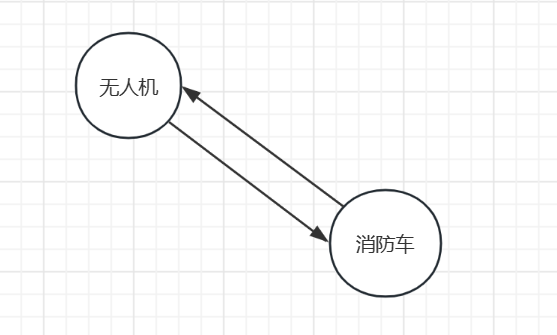

分布式通信概念图

#### 集中有中心式方案

   增加一个通信中心节点。无人机节点和消防车节点只与中心节点通信。优点是结构清晰,节点职责明确。缺点是中心节点故障会导致全系统瘫痪。

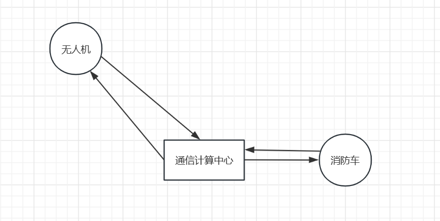

集中式通信概念图

### 比较与选择

经比较,我们选择了集中有中心式的系统设计方案。

该方案引入通信中心节点,使系统结构更加清晰,各个节点职责明确,有利于系统的扩展和维护。同时中心开发板有较强的计算能力，有能力处理来自无人机拍摄的图像信息。中心节点作为专门的通信协调平台,可以集中进行通信优化和协同控制算法设计。即使新增节点,也只需接入中心节点,无需调整其他节点。

相比之下,分布式方案节点之间通信机制复杂、边缘计算压力过大、不利于迭代开发。

综上,集中式系统更符合我们的设计要求,因此确定采用该方案。

### 方案论证

该集中式方案**工作原理**是:

1. 通信中心节点为无人机节点和消防车节点提供通信接口和协同控制算法。

2. 无人机节点和消防车节点只负责自主行为和数据收发,不处理系统层面的协调。

3. 中心节点统一处理通信交互和任务分配,指挥并协调无人机和消防车的行动。

4. 中心节点负责对图像的处理分析，并将分析结果作为发送给无人机和消防车。

采用该方案可以实现以下**设计目标**:

1. 节点解耦,软件设计更加清晰,便于迭代开发。

2. 中心节点计算资源丰富，可以符合图像处理对于计算性能的要求

## 电路与程序设计

### 系统构成

#### 无人机单元

本项目选用大疆创新的Tello教育版无人机作为空中平台。Tello无人机具有轻巧机身和灵活机动性,同时大疆提供了完善的软件开发工具包(DJI SDK)供用户编程控制。

DJI SDK包含详尽的API参考文档、示例代码、仿真模拟器等资源。通过SDK,我们可以用Python等高级语言对Tello进行编程,实现精确的飞行控制和传感信息获取。此外,SDK还提供了丰富的调试工具和运行分析模块,可以帮助开发者高效地测试和诊断程序。

Tello自带的可视光和红外摄像头能够满足项目中的视觉识别需求。大疆的无线镜头传输技术保证了实时的高清视频流传输,为视觉引导的飞行提供支持。

此外,RoboMaster是一个上层的Python API库,封装了DJI SDK中的无人机控制接口。通过该库我们可以使用简单的Python代码实现Tello的起飞、悬停、运动等基本控制,以及获取传感器数据如图像、姿态等。RoboMaster库为本项目的开发提供了便利。

大疆Tello无人机具有成熟的软件开发工具包支持,满足本项目的需求,是建立系统原型的理想选择。

#### 消防车单元

项目采用传统的四轮双驱的微缩车作为对消防车的模拟。

微缩车采用 K210 模块作为主控上位机，它拥有强大的数据处理和计算能力。具有较高的处理器速度和较大的内存，可以运行Python程序。在这个系统中，K210 模块的主要职责是处理和决策高层逻辑，如路径规划、目标识别、避障等，以及与下位机 Arduino nano 单片机之间的数据交互。K210 模块接入了摄像头模块和wifi模块，可以进行图像识别、无线通信等复杂任务。

微缩车使用了一片Arduino单片机作为下位机，在这个系统中的主要职责包括 1. **控制执行部件**：根据主控开发板的指令，生成控制信号驱动电机、舵机等执行部件。2. **读取传感器数据**：读取系统中的各种传感器数据（如电机的转速、舵机的角度等），然后将这些信息反馈给主控开发板。Arduino实时性强、稳定性好、功耗低，完成一些对实时性要求高、数据处理量不大的任务。

总的来说，K210 模块和Arduino单片机在这个系统中的协作关系是：主控开发板负责高层的逻辑处理和决策，下位机负责底层的设备控制和状态反馈。两者通过有线连接进行数据交换，共同完成微缩消防车的任务。

#### 通信与计算中心节点

通信计算中心采用 Nvidia Jetson Nano 嵌入式开发板。

开发板安装了 Ubuntu 系统，作为整个系统的控制中心和计算中心。它接受来自无人机巡逻过程中拍摄到的图像信息，并实时进行分析，识别火源，并将分析得到的地点结果发给消防车节点。

Ubuntu 操作系统为系统提供了稳定和可靠的基础。它具有广泛的软件支持和开发工具，使得开发人员能够轻松地进行应用程序的开发和部署。

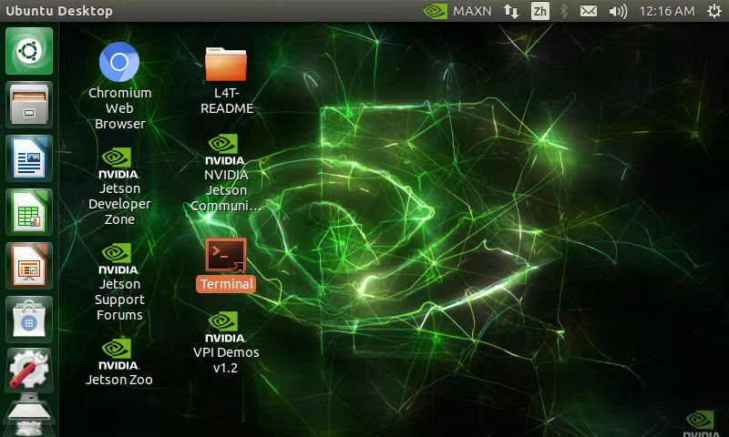

ubuntu 图形界面

其次，Nvidia Jetson Nano 嵌入式开发板搭载了 Nvidia 的 GPU 架构，具备强大的并行计算能力。这使得它能够高效地处理图像和视频数据，实时进行图像分析和处理。通过使用先进的图像处理算法和深度学习技术，它能够准确地识别火源迹象，并进行实时的火源分析。

#### 模拟火源

使用 Arduino nana 控制多束红色 LED 灯光, 使用电池供电。集成了感光模块，在接受激光照射后实现熄灭 LED 灯的简单控制。

### 电气原理图及核心模块电路图

#### 无人机

##### 电路结构

Tello 四旋翼无人机采用了经典的四旋翼飞控结构,其电路系统主要由飞控主板、电机控制器、传感器、电机和电池组成。

飞控主板集成了三轴陀螺仪、三轴加速度计等传感器,用于解算无人机的姿态和高度信息。主板还会生成四路电机控制信号,通过电机控制器驱动四个无刷电机。

四个电机安装在四个机臂上,提供垂直方向的升力和力矩。电机由可充电锂电池供电，轻量化且能提供良好的续航

飞控主板上的芯片内置了无人机的底层稳定和控制算法,能够根据传感器数据进行高速运算,做出稳定控制决策。主板还集成了 WiFi 模块和扩展接口,可以通过 API 进行高级编程控制。

综上所述,该无人机采用经典的模块化设计,通过本地闭环控制实现飞行稳定,同时提供开放接口进行高层次编程。这类设计结构简单可靠,十分适合作为系统原型机。

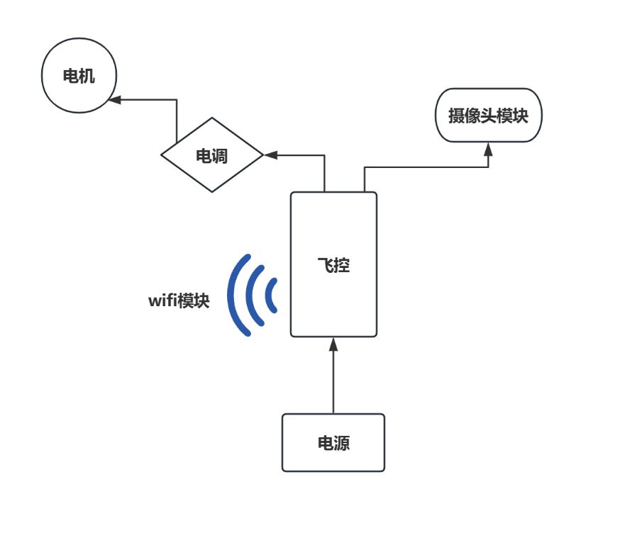

无人机电气原理图

#### 微缩消防车

首先，Arduino Nano作为一个微控制器，它处理并控制来自其他模块的信号，直接连接在主板上。主板是整个电路的中心和基础，它负责连接并向所有其他组件供电以及传输信号。电源模块则向主板提供所需的电力。电动机和舵机是小车的动力源，电动机主要提供直线运动，舵机则负责转向，它们从主板获得电力，并根据Arduino Nano发出的控制信号进行操作。编码器用于测量电动机的旋转，这对于控制小车的速度和方向至关重要，其数据输出会被Arduino Nano读取并处理。Arduino Nano将通过串口与K210模块进行通信。在这个系统中，Arduino Nano负责处理编码器的数据，控制电动机和舵机，同时还与K210模块进行信息交换。


消防车电气原理图

#### 通信计算中心

这里的电路结构较为简单，主要需要有稳定可靠充足的电源给开发板供电。开发板通过wifi信号与其他节点进行通信。

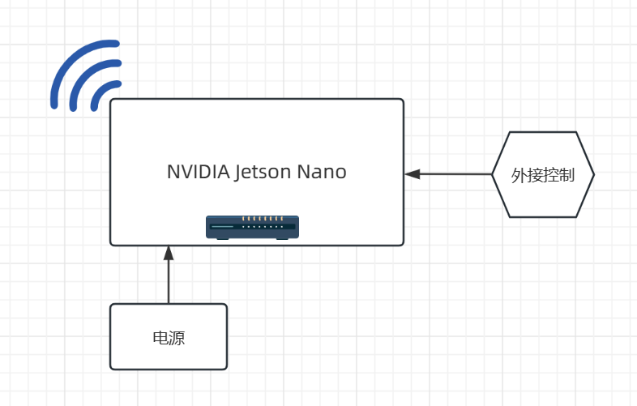

通信计算中心电气原理图

#### 模拟火源电路

这个小电路系统用来模拟火源的存在，以及扑灭火源的反馈。使用Arduino Nano作为微控制器，感光模块接受信号输入（集成了光敏电阻的传感器）。当感光模块接受光照信号后，Arduino Nano 进行简单的处理和计算，进行熄灯或亮灯的决策。这是一个相对独立的模块。


模拟火源电气原理图

### 系统工作流程及关键模块软件设计

概述：通过大疆无人机提供的 RoboMaster SDK 进行开发，通过其 python API 进行控制程序的编写。无人机完成巡逻并拍摄图像数据，通过 wifi 发送到运行 Linux 系统的上位机，上位机实时获取无人机的位置信息以及相应的火源存在情况。通过预训练好的yolo数据集进行实时目标（火源）监测，提取为“火源+位置”的信息后发送到消防车端。消防车端的 K210 模块通过wifi接收到来自通信中心的位置信号。K210 得到位置信号后一方面实时更新显示无人机位置坐标信息，一方面向Arduino下位机发送移动的指令。

#### 无人机部分

无人机使用大疆提供的 RoboMaster SDK 进行控制，使用python语言。使用时需要将上位机的python版本调整到和官方库支持相匹配的版本，然后导入依赖的库，即可进行开发。本项目主要是控制无人机的巡航以及适当的间隔时间进行拍照。

在开发过程中，我们在电脑上编写代码进行对无人机巡航控制与信息传输的调试。在实际运行的过程中，我们在开发板的Linux系统中配置相同的环境，并运行相同的代码，使无人机完成期望的任务。


无人机开发代码示例（视觉部分）

#### 消防车部分

##### K210模块

K210 支持若干种开发环境。本项目采用 microPython 进行开发，这样可以免除编译环境配置的麻烦，把脚本存在SD卡里即可开机运行。由于本项目对车端的边缘计算要求并不高，所以未充分使用 K210 芯片的神经网络加速单元的算例和 canmv 对于深度学习开发的支持。然而由于 K210 模块对于摄像头和wifi模块的集成、canmv 对 K210 的适配，K210 + canmv 仍然是理想的开发环境。

实现流程是在电脑上使用 canmv IDE 进行开发。进行代码的编写和上传。小车即会按照python脚本进行运动的控制、与外界进行通信。

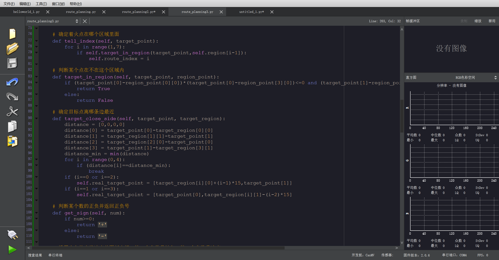

消防车运动开发代码示例

##### Arduino Nano模块

通过 Arduino IDE 进行代码的编写和烧录。为实现对不同硬件的驱动和与不同模块之间的通信，我们导入了多个模块的库(libraries)。

Arduino 单片机不断接收来自上位机 K210 发送的字符串信号，解析信号后给电机和舵机发送对应指令进行运动的控制。同时，Arduino不断接受来自编码器和舵机的信号，从而进行局部的闭环控制。


消防车Arduino下位机开发代码示例

#### 通信中心部分

##### 开发板系统

在 Jetson Nano 上安装了Ubuntu系统，通过wifi与无人机、消防车组网。该嵌入式开发板运行python脚本并接收来自无人机的图像信息。通过预训练的yolo模型进行实时的yolo数据集进行实时目标（火源）监测。当解算到火源的位置信息后，将信息发送给消防车。

##### yolo模型训练部分

我们预先让无人机巡航一圈并采集适量的样本照片，然后手动框出火源进行图片的标注。接下来在本地进行数据模型的训练。

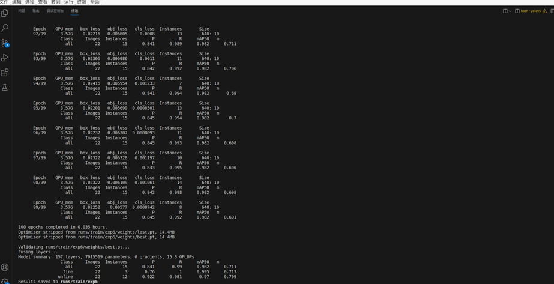

模型训练过程截图

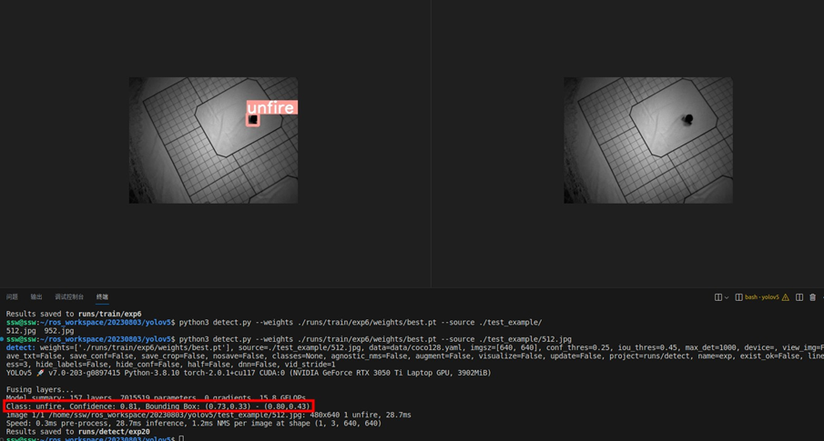


识别效果截图

## 测试方案与测试结果

### 测试方案及测试条件

#### 测试标准

我们测试的主要标准主要有两点 **1. 准确性** **2. 时效性**

##### 准确性

1. 火源识别的准确性，即是否能够正确识别到火源。
2. 坐标反馈的准确性，经过无人机的反馈以及计算中心的处理，是否能够得到准确的火源坐标。
3. 至灭火点导航的准确性，即微缩消防车是否能够到达指定范围。

##### 时效性

1. 无人机是否能在保持稳定的条件下达到更高的巡逻速度。
2. 无人机是否能够及时拍摄并传回当前地区的照片。
3. 计算中心是否能够即使解算出无人机所在位置的火情情况。
4. 微缩消防车是否能够及时收到来自计算通信中心的位置信息并做出反应。

#### 测试方案

方案即模拟真实情况，随机部署火源，启动无人机进行巡航，传回消息，消防车做出反应。测试无人机完成巡航所需的时间以及消防车前往指定位置完成灭火的时间。

#### 测试条件

搭建了1：1的模拟地图，并且形成了无人机安全飞行的空间。

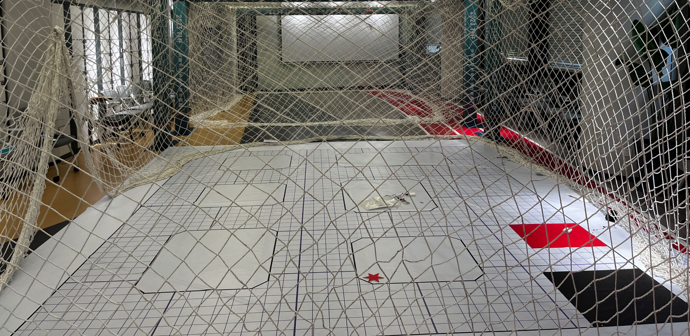

### 测试结果

准确性良好，飞行效率高。

### 系统工作成效分析

根据测试方案和测试结果,我对这个空地协同智能消防系统的工作成效进行以下分析:

一、在准确性方面,测试表明:

1. 经过模型训练,系统能够准确识别模拟场景中的火源,火源识别准确率高。

2. 无人机能够准确获取自身位置信息,并经计算中心处理后,反馈的火源坐标准确可靠。

3. 消防车能够精确驶达指定的火源位置,完成灭火任务,导航准确性高。

上述结果表明,系统在火源检测、定位和导航方面都具有较高的准确性。

二、在时效性方面,测试表明:

1. 在保证飞行稳定的前提下,无人机巡逻效率较高,完成飞行任务的时间短。

2. 系统响应迅速,无人机能即时拍照并传回图像,计算中心也能快速解析定位。

3. 消防车响应灵敏,能够在很短时间内接到指令并出动。

通过上述性能指标的测试,系统显示出了较强的实时响应能力。

综上,系统在准确性和时效性这两个关键性能指标上都取得了良好的结果,达到了设计目标,整体工作成效较好。系统性能可靠稳定,能够满足实际应用需求。后续可通过进一步优化算法和提升硬件性能,使系统效果更佳。

## 参考资料

G题_空地协同智能消防系统(1).pdf. (2023). 2023 年全国大学生电子设计竞赛试题

睿炽科技. (2020). RoboMaster TT Tello Talent 用户手册 [User Manual]. (V1.0). <https://www.dji.com/robomaster-tt>

刘保健（2022）.《不确定环境下无人机与无人车双层路径规划算法研究》[硕士学位论文, 哈尔滨工业大学].

范勇生. (2022). 基于空地多视角协同探测的同时定位与建图方法研究 [硕士学位论文, 哈尔滨工业大学].

律朝辉（2021）.基于无人机的森林火情监测与路径规划研究 [硕士学位论文，西安理工大学].

邹鹏程（2021）.微小型空地无人系统协同导航技术研究[硕士学位论文,哈尔滨工业大学].

赵文杰. (2022). 无人机/无人车混合编队的趋同控制与轨迹跟踪研究 [硕士学位论文, 长安大学].

徐鹏凯. (2023). 一种无人机和无人车结合的高层建筑消防装备的设计. 科技与创新, (02), 65.

RoboMaster. (n.d.). RoboMaster SDK Documentation. Retrieved August 5, 2023, from <https://robomaster-dev.readthedocs.io/zh_CN/latest/index.html>

RoboMaster. (n.d.). Python SDK - 简单无人机. Retrieved August 5, 2023, from <https://robomaster-dev.readthedocs.io/zh_CN/latest/python_sdk/beginner_drone.html#id6>

腾讯云. (n.d.). Article-tt. Retrieved August 5, 2023, from <https://cloud.tencent.com/developer/search/article-tt>

DJI-SDK. (n.d.). RoboMaster-SDK. Retrieved August 5, 2023, from <https://github.com/dji-sdk/RoboMaster-SDK/blob/master>

Diustou Wiki. (n.d.). Raspberry Pi 4 Model B. Retrieved August 5, 2023, from <https://wiki.diustou.com/cn/Raspberry_Pi_4_Model_B>

NVIDIA Developer. (n.d.). Getting Started With Jetson Nano Developer Kit. Retrieved August 5, 2023, from <https://developer.nvidia.com/embedded/learn/get-started-jetson-nano-devkit#write>

NVIDIA Developer Forums. (n.d.). Sending serial rx/tx data from Jetson Nano to Arduino. Retrieved August 5, 2023, from <https://forums.developer.nvidia.com/t/sending-serial-rx-tx-data-from-jetson-nano-to-arduino/123363>

Arduino. (n.d.). Linux Tutorials. Retrieved August 5, 2023, from <https://docs.arduino.cc/software/ide-v1/tutorials/Linux>

0xsuk. (2022, July 19). How to install CH340 on Ubuntu 22.04. Retrieved August 5, 2023, from <https://0xsuk.github.io/posts/2022-07-19-how-to-install-ch340-on-ubuntu-22.04/>

Ultralytics. (n.d.). Running on Jetson Nano. Retrieved August 5, 2023, from <https://docs.ultralytics.com/yolov5/tutorials/running_on_jetson_nano/#before-you-start>
